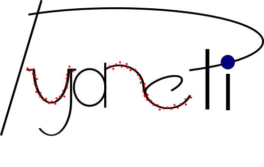
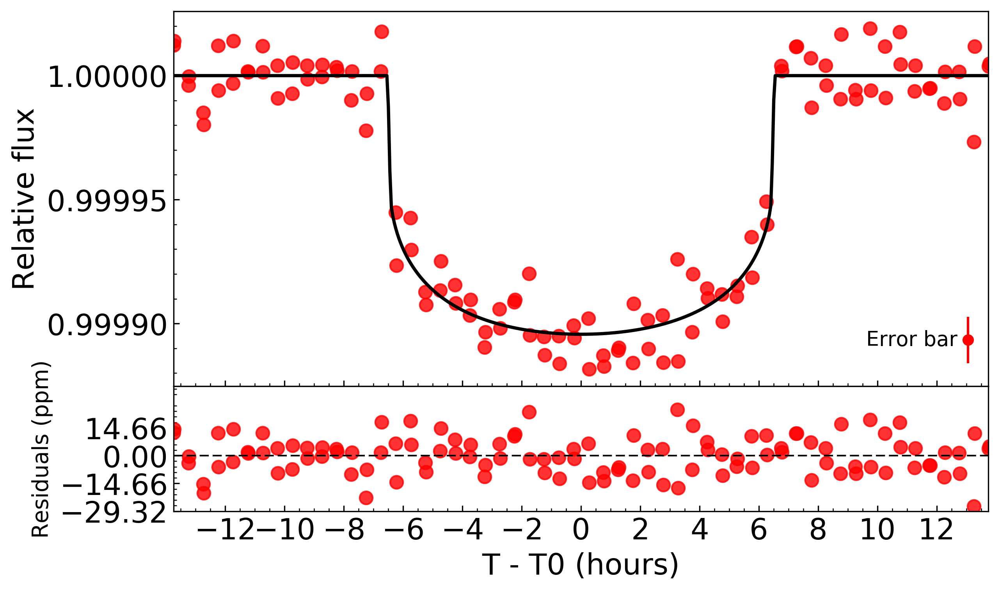
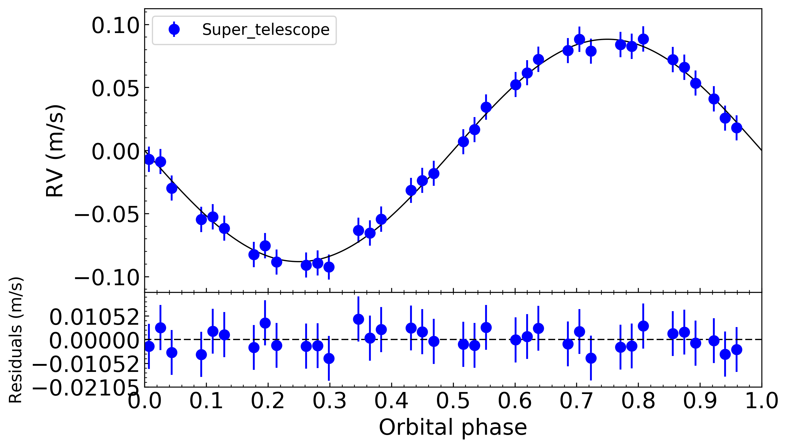

# __pyaneti__
#### Written by Barragán O. et al. 2016
##### email: oscaribv@gmail.com
##### Updated Jun 29, 2016

### __Introduction__

* _Pianeti_ is the Italian word for planets.
* It is a _python/fortran_ software suite which finds the best fitting solution using Marcov Chain Monte Carlo (MCMC) methods.
* Ensemble sampler with affine invariance algorithm
for a major coverage of the parameter space
([Godman & Weare, 2010](http://msp.org/camcos/2010/5-1/p04.xhtml)).
* _Python_ does the nice things: Plots, call to functions, prints, input files.
* _Fortran_ does the hard work: MCMC evolution, $\chi^2$ calculation, ensemble sampler evolution.
* Open-source code (GPL v 3.0). No need to pay!
* ** Free and fast code with the robustness of _Fortran_ and the versatility of _Python_ **.

## __Power of pyaneti__

* Multiple independent Marcov Chains to sample the space parameters.
* Easy-to-use: it runs by providing only one input_fit.py file.
* Automatic creation of histograms, correlations, and ready-to-publish plots.
* Circular and elliptical orbits.
* RV multi-planet fitting.
* Systemic velocities for multiple instruments in RV fittings.
* Stellar limb darkening [(Mandel & Agol, 2002)](http://iopscience.iop.org/article/10.1086/345520/meta#artAbst).
* Correct treatment of short and long cadence data ([Kipping, 2010](http://mnras.oxfordjournals.org/content/408/3/1758)).
* Single and joint RV-transit fits.

## ** Dependencies **

You need to install in your computer:
* gfortran
* numpy
* matplotlib

## ** Start to use it now! **

You do not need install anything, just clone or download pyaneti.

```
git clone https://github.com/oscaribv/pyaneti
```

The advantage about cloning the repository is the possibility to follow the changes to this package easily with git pull (learn more about git
in [https://git-scm.com/](https://git-scm.com/)).
Or if you want

```
wget https://github.com/oscaribv/pyaneti/archive/master.zip
unzip master.zip
mv pyaneti_master pyaneti
```

if you choose this option, you should repeat it every time the code is updated.

The next step is to get inside the pyaneti folder and see what we can find inside it

```
cd pyaneti
ls
  LICENSE   outpy  src inpy  makefile  pyaneti.py  README.md
```

 type ``make``, you would see a lot of text apearing in the terminal, after it finishes, you are done!

```
make
```

If you have all the dependencies installed, the make procces ended without any error.
Now you are ready to run the code for the first time.

```
./pyaneti.py test
```

or

```
python pyaneti.py test
```

The program will start. You will see a lot of things appearing on your screen, ignore them now. Wait a couple of minutes and then you should see something like:

```
--------------------------------------------------------------
Summary:
N_chains    =      100
N_conv      =      500
thin_factor =        1
N_rv_data   =       36
N_tr_data   =      108
N_data      =      144
N_pars      =        8
chi2_rv     = 7.2725
chi2_tr     = 121.4862
chi2        = 128.7587
ln likelihood_rv= 377.7473
ln likelihood_tr= 1090.7816
ln likelihood  = 1468.5289
DOF         =      136
chi2_red    = 0.9468
scale factor= 1.0000
BIC from likelihood   = -2897.2993
--------------------------------------------------------------
             INPUT STELLAR PARAMETERS
--------------------------------------------------------------
M_*     = 1.0000000 - 0.1000000 + 0.1000000 solar masses
R_*     = 1.0000000 - 0.1000000 + 0.1000000 solar radii
T_*     = 5600.0000000 - 100.0000000 + 100.0000000 K
--------------------------------------------------------------
Output format
par  = median -  16% + 84%   units %
        mode  , 0.5% , 99.%  units %
--------------------------------------------------------------
                   Parameters testb
--------------------------------------------------------------
-------------------------Fitted-------------------------------
T0   = 2448285.0955427 - 0.0032530 + 0.0033853  days
       2448285.0949697 , 0.0066412 , 0.0078293  days
P    = 365.2506767 - 0.0048872 + 0.0051283  days
       365.2509487 , 0.0121289 , 0.0120949  days
ew 1 = 0.0000000 - 0.0000000 + 0.0000000
       0.0000000 , 0.0000000 , 0.0000000
ew 2 = 0.0000000 - 0.0000000 + 0.0000000
       0.0000000 , 0.0000000 , 0.0000000
b    = 0.0000000 - 0.0000000 + 0.0000000
       0.0000000 , 0.0000000 , 0.0000000
a/R* = 215.3671065 - 2.1707706 + 2.2392862
       215.0890141 , 5.3934683 , 5.1852793
Rp/R*= 0.0093247 - 0.0000755 + 0.0000726
       0.0093250 , 0.0001893 , 0.0001864
K    = 0.0880814 - 0.0024351 + 0.0023554  m/s
       0.0879033 , 0.0061991 , 0.0058341  m/s
-------------------------Derived------------------------------
e    = 0.0000000 - 0.0000000 + 0.0000000
       0.0000000 , 0.0000000 , 0.0000000
w*   = 0.0000000 - 0.0000000 + 0.0000000  deg
       0.0000000 , 0.0000000 , 0.0000000  deg
i    = 90.0000000 - 0.0000000 + 0.0000000  deg
       90.0000000 , 0.0000000 , 0.0000000  deg
a    = 1.0013286 - 0.0994162 + 0.0998147  AU
       0.9881785 , 0.2578754 , 0.2622659  AU
rho* = 1.4164481 - 0.0423624 + 0.0446671  g/cm^3 (transit light curve)
       1.4098615 , 0.1037223 , 0.1048312  g/cm^3
rho* = 1.4076938 - 0.3665849 + 0.5479150  g/cm^3 (input stellar parameters)
       1.2780949 , 0.7420830 , 2.1300649  g/cm^3
Mp   = 0.9833907 - 0.0710440 + 0.0706334 M_earth
       0.9811334 , 0.1842686 , 0.1815355
Rp   = 1.0165554 - 0.1001570 + 0.1013906 R_earth
       1.0025874 , 0.2607939 , 0.2655095
rho_p= 5.1309791 - 1.3024923 + 1.9495382  g/cm^3
       4.6753147 , 2.6502352 , 7.5913062  g/cm^3
g_p  = 935.5562871 - 31.0877518 + 30.9488200  cm/s^2
       934.6027864 , 76.8007157 , 79.7403289  cm/s^w
wp   = 180.0000000 - 0.0000000 + 0.0000000  deg
Tperi= 2448193.7828590 - 0.0042181 + 0.0043923  days
       2448193.7828029 , 0.0090307 , 0.0101832  days
a(T0)= 215.3671065 - 2.1707706 + 2.2392862    (Planet-star distance at T0)
       215.0890141 , 5.3934683 , 5.1852793
r(T0)= 1.0013286 - 0.0994162 + 0.0998147  AU (Planet-star distance at T0)
       0.9881785 , 0.2578754 , 0.2622659  AU
P2/a3= 0.9930878 - 0.2605012 + 0.3877690     (P^2 G (m1 + m2) ) / ( 4 pi^2 a^3)
       0.8807423 , 0.5255647 , 1.5163416
Teq  = 269.8787934 - 5.0492315 + 5.0454495  K (albedo=0)
       269.9117365 , 13.0076488 , 12.8296800  K
T_tot= 13.0771184 - 0.1344677 + 0.1325346  hours
       13.0896673 , 0.3068228 , 0.3357614  hours
T_i/e= 0.1207939 - 0.0012769 + 0.0012866  hours
       0.1208241 , 0.0029569 , 0.0031516  hours
--------------------------------------------------------------
--------------------  Other parameters -----------------------
q1    = 0.3807925 - 0.0445818 + 0.0425590
        0.3803222 , 0.1203602 , 0.1101484
q2    = 0.3162294 - 0.0451910 + 0.0481998
        0.3153383 , 0.1168992 , 0.1215770
u1    = 0.3893389 - 0.0579694 + 0.0603924
        0.3931163 , 0.1502515 , 0.1541280
u2    = 0.2251364 - 0.0601272 + 0.0599357
        0.2186243 , 0.1512705 , 0.1558808
Super_telescope = 22.0719864 - 0.0000016 + 0.0000016 km/s
       22.0719867 , 0.0000042 , 0.0000043
--------------------------------------------------------------
```
Once see this, you will see some plots similar to





Let me explain you briefly what this is:
> If you were an advanced alien civilization with really high technology, and "lucky" enough to see the Earth crossing in front of the Sun, **this is how the Earth would look like to you**.

Look at those well known parameters:
* 1 Earth Mass
* 1 Earth radii
* Period of 365 days
* 1 AU semi-major axis
* Density of 5.5 g/cm^2,
* Gravity of 10 m/s^2.  

Of course you would need a spectograph with a precision of a few cm/s and also a very nice photometer.

> If you are at this point, you learned two things. First, with good data you can obtain really nice planet parameters and second, you learned how to run pyaneti.  


## ** Create your own setup **
_Work in progress!_

## ** Documentation **

_Work in progress!_

## ** Science  with pyaneti **
* Nespral et al., 2016, _Mass determination of K2-19b and K2-19c from radial velocities and transit timing variations_, A&A, submitted, (http://arxiv.org/abs/1604.01265)
* Barragán et al, 2016, _EPIC 211391664b: A 32-M⊕ Neptune-sized planet in a 10-day orbit transiting an F8 star_, AAS, submitted, (http://arxiv.org/abs/1608.01165)

## ** Acknowledgements **
* to Davide Gandolfi, for his support and motivation to create this code.
* to Hannu Parviainen, to help me to interpret the first result of the PDF of the MCMC chains. I learned a lot!
* to Mabel Valerdi, to help me with as the first pyaneti user, to detect bugs and errors in this manual. As well for its idea for the pyaneti's logo.
* to Salvador Curiel, for his suggestions to parallelize the code.

**THANKS!**
